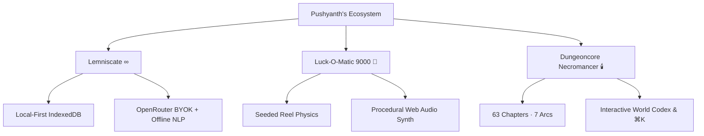

<div align="center">

# ✦ Pushyanth ∞ — Portfolio

<p align="center">
  <strong>Build with AI. Ship with certainty.</strong><br>
  <em>A warm, tactile "sticker notebook" portfolio engineered for the open web.</em>
</p>

<p align="center">
  <a href="https://pushyanth02.github.io/Portfolio/"></a>
  <a href="https://github.com/Pushyanth02"></a>
  <a href="https://www.linkedin.com/in/pushyanth-reddy"></a>
</p>

<p align="center">
  
  
  
  
  
  
  
</p>

<br>

</div>

---


> **⚠ © ALL RIGHTS RESERVED**
> The code, design, copy & artwork in this repository are the exclusive property of **Pushyanth**.
> Cloning, rehosting, or reusing any part of it as your own portfolio is **expressly prohibited** — see [LICENSE](./LICENSE).
> Unauthorized deployments are flagged automatically by an embedded integrity check.
## ✦ Table of Contents

- [✦ Overview](#-overview)
- [🚀 Featured Shipped Work](#-featured-shipped-work)
- [⚖️ The 3 Engineering Laws](#️-the-3-engineering-laws)
- [🛠️ AI Workbench (13 Daily Drivers)](#️-ai-workbench-13-daily-drivers)
- [🎨 Design System & Aesthetics](#-design-system--aesthetics)
- [🧩 Interactive Highlights & Easter Eggs](#-interactive-highlights--easter-eggs)
- [🧱 Tech Stack & Zero-Runtime Architecture](#-tech-stack--zero-runtime-architecture)
- [⚡ Quick Start & Development](#-quick-start--development)
- [🌐 GitHub Pages CI/CD Deployment](#-github-pages-cicd-deployment)
- [📬 Connect](#-connect)

---

## ✦ Overview

This is the personal portfolio of **Pushyanth** — a CS student, systems builder, and software crafter based in Bangalore, India. 

Designed with a cozy, hand-crafted **"sticker notebook"** aesthetic, this site showcases full-stack systems where frontier AI tools (Claude, Gemini, OpenAI, Grok) accelerate builds while the core remains **deterministic, auditable, and self-hosted**.

- **Zero database, zero server runtime, zero API proxies** — 100% static export deployable anywhere.
- **Micro-animated, accessible, and fast** — full `prefers-reduced-motion` compliance, semantic HTML, and zero external runtime CDNs.
- **Local & sovereign** — all illustrations and icons are bundled locally with zero cloud hostages.

---

## 🚀 Featured Shipped Work

| Project | Role & Category | Live Demo | Repository | Highlights |
| :--- | :--- | :---: | :---: | :--- |
| **Lemniscate ∞** | Flagship · Local-First AI Reading Room | [**Live App** ↗](https://lemniscate2.vercel.app) | [**Source** ↗](https://github.com/Pushyanth02/Lemniscate) | Sovereign IndexedDB vault, zero-proxy OpenRouter BYOK, 3 margin companions (Luma, Ouro, Ankaa), offline Anchor NLP engine. |
| **Luck-O-Matic 9000 🎰** | Luck Tycoon · Narrative Idle Incremental | [**Play Now** ↗](https://Pushyanth02.github.io/LuckOMatic-9000/) | [**Source** ↗](https://github.com/Pushyanth02/LuckOMatic-9000) | Grandpa Otto's 1962 charm-printing machine, 30 charms (6 tiers), 15 buried relics, procedural Web Audio synth, 5-act cassette lore. |
| **Dungeoncore Necromancer 🕯️** | Serialized Novel & Narrative Engine | [**Read Online** ↗](https://pushyanth02.github.io/Dungeoncore-Necromancer/) | [**Source** ↗](https://github.com/Pushyanth02/Dungeoncore-Necromancer) | 63 chapters across 7 arcs, interactive World Codex (8 factions), 6 generative Web Audio soundscapes, ⌘K search, calibrated void dark mode. |



---

## ⚖️ The 3 Engineering Laws

```
┌─────────────────────────────────────────────────────────────────────────────┐
│ 01 · AUDITABLE BY DESIGN                                                    │
│ Deterministic core. AI at the steering wheel. Every pipeline bit-for-bit   │
│ replayable and inspectable. Never outsource truth to a black box.           │
├─────────────────────────────────────────────────────────────────────────────┤
│ 02 · ZERO HOSTAGES · LOCAL FIRST                                            │
│ Your data stays on your metal. Offline-first architectures, SQLite,         │
│ IndexedDB, zero tracking telemetry, and a locked front door.                │
├─────────────────────────────────────────────────────────────────────────────┤
│ 03 · OPEN SOURCE MAXIMALISM                                                 │
│ Compound under the sunlight of the open web. Chase bleeding-edge tools,     │
│ ship in public, and build software the community can inspect and fork.      │
└─────────────────────────────────────────────────────────────────────────────┘
```

---

## 🛠️ AI Workbench (13 Daily Drivers)

Tools, frontier models, and agentic workflows in active daily rotation:

| Category | Drivers |
| :--- | :--- |
| **Frontier Models & APIs** | Claude, ChatGPT, Gemini, Grok, Qwen, NVIDIA NIM |
| **Agentic IDEs & Tooling** | Google Antigravity, Claude Code, VS Code, Kiro, Codex, Google AI Studio, Z.ai |

---

## 🎨 Design System & Aesthetics

The interface is calibrated around a warm, tactile **"sticker notebook"** visual language with hard borders and offset ink drop shadows:

| Token | Value | Purpose |
| :--- | :--- | :--- |
| `--cream` | `#F5EFE3` | Warm paper base background |
| `--card` | `#FBF6EC` | Card and component surfaces |
| `--ink` | `#201A14` | Primary high-contrast text, hard 1.5px borders, shadows |
| `--coral` | `#E8603C` | Primary accent — CTAs, active links, mascot highlights |
| `--leaf` | `#3E7C4F` | Privacy, local-first, and side-quest badge accent |
| `--sun` | `#F2B33D` | Interactive hover accent and warm highlights |
| `--sun-soft`| `#FBE7B6` | Workbench and sticker background |

### Typography

- **Headlines / Display:** `Fraunces` (600/700, Italic) — warm serif with editorial charm.
- **Body Prose:** `Epilogue` (400/500/600) — clean, readable geometric sans.
- **Labels & Stats:** `Space Mono` (400/700) — technical precision for metadata and timestamps.

---

## 🧩 Interactive Highlights & Easter Eggs

- **Rover (The Roaming Mascot):** An autonomous, friendly infinity symbol that wanders the viewport avoiding text, and bursts into a bounce + heart/star celebration when clicked or docked.
- **Interactive Workbench Stickers:** Hand-tilted badges with dynamic 3D hover states.
- **Dual Action Project Cards:** Instant click-through pills for both GitHub source code and live interactive builds.
- **Live IST Clock:** Client-synchronized time counter calibrated for Bangalore, India (`UTC +5:30`).
- **Click-to-Copy Connect:** Assembled client-side contact cards with instant clipboard toast notifications via Sonner.

---

## 🧱 Tech Stack & Zero-Runtime Architecture

```
.
├── .github/workflows/deploy.yml   # Automated GitHub Pages CI/CD pipeline
├── public/
│   ├── art/                       # In-house vector illustrations (WebP)
│   ├── favicon.svg                # Coral infinity brand icon
│   └── robots.txt
├── src/
│   ├── app/
│   │   ├── globals.css            # Complete design system & token definitions
│   │   ├── layout.tsx             # Root layout, Google Fonts, JSON-LD Schema
│   │   └── page.tsx               # Orchestrator for all page sections
│   ├── components/
│   │   ├── site/                  # Hero, Work, Beliefs, Workbench, Rover, Connect
│   │   └── ui/                    # Sonner toast provider
│   └── lib/
│       └── utils.ts               # Class merging & asset path resolution
├── next.config.ts                 # Next.js static export & basePath config
├── package.json                   # Minimal audited runtime dependencies
└── tsconfig.json                  # Strict TypeScript configuration
```

### Dependencies

| Package | Version | Purpose |
| :--- | :--- | :--- |
| `next` | `16.1.3` | App Router static HTML export |
| `react` / `react-dom` | `19.0.0` | Modern React UI runtime |
| `sonner` | `^2.0.7` | Toast feedback notifications |
| `clsx` + `tailwind-merge` | `latest` | Utility class composition |

---

## ⚡ Quick Start & Development

### Prerequisites

- [Node.js](https://nodejs.org/) ≥ 20
- [Bun](https://bun.sh/) (recommended) or `npm` / `pnpm`

### 1. Clone & Install

```bash
git clone https://github.com/Pushyanth02/Portfolio.git
cd Portfolio
bun install
```

### 2. Run Locally

```bash
bun run dev
```

Visit [`http://localhost:3000`](http://localhost:3000) in your browser.

### 3. Build Static Export

```bash
bun run build
```

Generates a fully self-contained static site inside the `out/` directory.

---

## 🌐 GitHub Pages CI/CD Deployment

The repository includes an automated workflow (`.github/workflows/deploy.yml`):

1. Pushes to `main` trigger an automated Next.js build.
2. `NEXT_PUBLIC_BASE_PATH` automatically configures sub-path routing if deployed to `username.github.io/Portfolio`.
3. GitHub Actions deploys the static `out/` bundle directly to GitHub Pages.

---

## 📬 Connect

- 🌐 **Portfolio:** [pushyanth02.github.io/Portfolio](https://pushyanth02.github.io/Portfolio/)
- 💻 **GitHub:** [@Pushyanth02](https://github.com/Pushyanth02)
- 💼 **LinkedIn:** [Pushyanth Reddy](https://www.linkedin.com/in/pushyanth-reddy)
- ✉️ **Email:** [pushyanth2008@gmail.com](mailto:pushyanth2008@gmail.com)

---

<div align="center">
  <sub>© 2025–2026 Pushyanth. Handcrafted with care on the open web.</sub>
</div>

---

## ⚖️ Copyright & Anti-Replication Notice

**© Pushyanth. All Rights Reserved.**

This portfolio's **source code, design system, copy/text, artwork, and branding** are proprietary and protected by copyright law. The [`LICENSE`](./LICENSE) grants **no rights by default**.

| ✅ Allowed | ❌ Not allowed |
| --- | --- |
| Reading the code to learn | Copying code/design/copy/art into another project |
| Quoting brief text **with credit** | Cloning or forking this repo as your own portfolio |
| Linking to the live site | Rehosting or deploying the site anywhere else |

- Unauthorized deployments trigger a built-in integrity banner branding them as stolen copies.
- AI/scraper bots are blocked in [`robots.txt`](./public/robots.txt).
- Violations will receive **DMCA takedown notices** to hosts, platforms & registrars.

For permission or licensing inquiries → [GitHub](https://github.com/Pushyanth02) · [LinkedIn](https://www.linkedin.com/in/pushyanth-reddy)
